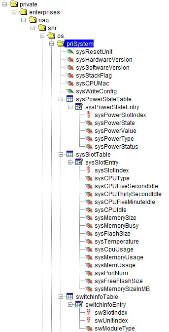
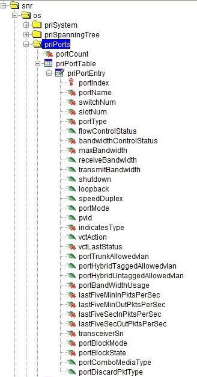
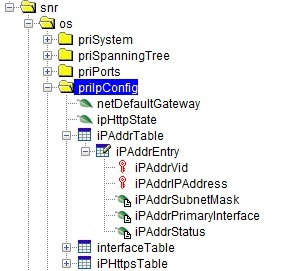

# generator.yml
``` yml
      # SNR_private
      - 1.3.6.1.4.1.40418.7.100.1.8.1.11	# sysCpuUsage
      - 1.3.6.1.4.1.40418.7.100.1.8.1.10	# sysTemperature
      - 1.3.6.1.4.1.40418.7.100.1.8.1.12	# sysMemoryUsage
      - 1.3.6.1.4.1.40418.7.100.1.8.1.7		# sysMemorySize
      - 1.3.6.1.4.1.40418.7.100.1.8.1.8 	# sysMemoryBusy
      - 1.3.6.1.4.1.40418.7.100.1.9.1.3		# swModuleType
      - 1.3.6.1.4.1.40418.7.100.1.7.1.2		# sysPowerState
      - 1.3.6.1.4.1.40418.7.100.1.2		# sysHardwareVersion
      - 1.3.6.1.4.1.40418.7.100.1.3 		# sysSoftwareVersion
      - 1.3.6.1.4.1.40418.7.100.1.5		# sysCpuMac
      - 1.3.6.1.4.1.40418.7.100.4.3.1.3		# ipAddrSubnetMask
      - 1.3.6.1.4.1.40418.7.100.4.3.1.5		# ipAddrStatus
      - 1.3.6.1.4.1.40418.7.100.3.2.1.1		# portIndex
      - 1.3.6.1.4.1.40418.7.100.3.2.1.2		# portName
      - 1.3.6.1.4.1.40418.7.100.3.2.1.3		# switchNum
      - 1.3.6.1.4.1.40418.7.100.3.2.1.4		# slotNum
      - 1.3.6.1.4.1.40418.7.100.3.2.1.5 	# portType
      - 1.3.6.1.4.1.40418.7.100.3.2.1.15 	# portMode
      - 1.3.6.1.4.1.40418.7.100.3.2.1.7 	# bandwidthControlStatus
      - 1.3.6.1.4.1.40418.7.100.3.2.1.8		# maxBandwidth
      - 1.3.6.1.4.1.40418.7.100.3.2.1.23	# portBandWidthUsage
      - 1.3.6.1.4.1.40418.7.100.3.2.1.28	# transceiverSn   
```
## SNR OID's
### Private system OID's```.1.3.6.1.4.1.40418.7.100.1...```

 

*   sysHardwareVersion ```(.1.3.6.1.4.1.40418.7.100.1.2)``` - The version information of switch hardware
*   sysSoftwareVersion ```(.1.3.6.1.4.1.40418.7.100.1.3)``` - The version information of switch software
*   ~~sysStackFlag ```(.1.3.6.1.4.1.40418.7.100.1.4)``` - If it is the status of stacking~~
*   sysCpuMac ```(.1.3.6.1.4.1.40418.7.100.1.5)``` - The MAC Address of the switch's CPU
*   #> sysPowerStateTable ```(.1.3.6.1.4.1.40418.7.100.1.7)``` - The power supply status is only used for chassis switch
*   *   sysPowerState ```(.1.3.6.1.4.1.40418.7.100.1.7)``` - If the power supply insert
*   #> sysSlotTable ```.1.3.6.1.4.1.40418.7.100.1.8``` - Machine information,it is only used by chassis.
*   *   sysSlotIndex ```(.1.3.6.1.4.1.40418.7.100.1.8.1.1)``` - Module Model No.
*   *   sysMemorySize ```(.1.3.6.1.4.1.40418.7.100.1.8.1.7)``` - Memory size
*   *   sysMemorySize ```(.1.3.6.1.4.1.40418.7.100.1.8.1.8)``` - Memory usage rent
*   *   ~~sysFlashSize ```(.1.3.6.1.4.1.40418.7.100.1.8.1.9)``` - The flash capacity of this slot~~
*   *   sysTemperature ```(.1.3.6.1.4.1.40418.7.100.1.8.1.10)``` - The Temperature of this slot.80 is 80centigrade, but -100 means that the slot does not support temperature display
*   *   sysCpuUsage ```(.1.3.6.1.4.1.40418.7.100.1.8.1.11)``` - The CPU usage of this slot
*   *   sysMemoryUsage ```(.1.3.6.1.4.1.40418.7.100.1.8.1.12)``` - The memory usage of this slot
*   *   sysPortNum ```(.1.3.6.1.4.1.40418.7.100.1.8.1.22)``` - The physical port number of this slot
*   *   ~~sysFreeFlashSize ```(.1.3.6.1.4.1.40418.7.100.1.8.1.23)``` - The free flash capacity of this slot in Kbytes~~
*   #> switchInfoTable ```(.1.3.6.1.4.1.40418.7.100.1.9)``` - Table of descriptive and status information about
 switches in this system
*   *   swSlotIndex ```(.1.3.6.1.4.1.40418.7.100.1.9.1.1)``` - This object identifies the slot within the switch
 for which this entry contains information. 
 While for the chassis device, the value is real switch slot number
*   *   swSlotIndex ```(.1.3.6.1.4.1.40418.7.100.1.9.1.2)``` - This object identifies the switch within the system
 for which this entry contains information. This
 value can never be greater than switchNumber
*   *   swModuleType ```(.1.3.6.1.4.1.40418.7.100.1.9.1.2)``` - Type of expansion module in this switch slot

### Private ports OID's```.1.3.6.1.4.1.40418.7.100.3...```

 

*   portCount ```(.1.3.6.1.4.1.40418.7.100.3.1)``` - The total number of ports in the system
*   #> priPortTable ```(.1.3.6.1.4.1.40418.7.100.3.2)``` - A list of port entries
*   *   portIndex ```(.1.3.6.1.4.1.40418.7.100.3.2.1.1)``` - Port No.
*   *   portName ```(.1.3.6.1.4.1.40418.7.100.3.2.1.2)``` - Name of the port
*   *   switchNum ```(.1.3.6.1.4.1.40418.7.100.3.2.1.3)``` - This value is denoting the number of swith in which this port resides.
For the non-stackable device,the value is always 1.
While for the stackable device, the value is real switch stack number
*   *   slotNum ```(.1.3.6.1.4.1.40418.7.100.3.2.1.4)``` - This value is denoting the number of slot.
For the static slot,the value is 1,while for 
the extended slot the value is real extended slot number
*   *   portType ```(.1.3.6.1.4.1.40418.7.100.3.2.1.5)``` - Type of expansion module in this port
*   *   bandwidthControlStatus ```(.1.3.6.1.4.1.40418.7.100.3.2.1.7)``` - The bandwidth-control status of the port. 
Its functionality is to stop the bandwidth control.
The only way to enable bandwidth control is to set receiveBandwidth or transmitBandwith
*   *   maxBandwidth ```(.1.3.6.1.4.1.40418.7.100.3.2.1.8)``` - The max bandwidth of the port
*   *   portMode ```(.1.3.6.1.4.1.40418.7.100.3.2.1.15)``` - port mode: 1 is access, 2 is trunk, 3 is hybrid
*   *   portBandWidthUsage ```(.1.3.6.1.4.1.40418.7.100.3.2.1.23)``` - The percentage of the port's bandwidth usage
*   *   transceiverSn ```(.1.3.6.1.4.1.40418.7.100.3.2.1.28)``` - The serial num of transceiver. If port is not a transceiver, value is null

### Private ip configuration OID's```.1.3.6.1.4.1.40418.7.100.4...```

 

*   #> ipAddrTable ```(.1.3.6.1.4.1.40418.7.100.4.3)``` - A list of port entries
*   *   iPAddrVid ```(.1.3.6.1.4.1.40418.7.100.4.3.1.1)``` - The VLAN interface being used by this table entry. Only the 
 VLAN interfaces which have an IP configured will appear in
 the table
*   *   portName ```(.1.3.6.1.4.1.40418.7.100.4.3.1.2)``` - The IP address of this Net interface. The default value
 for this object is 0.0.0.0. If either the IPAddrIPAddress
 or IPAddrSubnetMask is 0.0.0.0, then when the device
 boots, it may use BOOTP to try to figure out what these
 values should be. If BOOTP fails, before the device
 can talk on the network, this value must be configured
 (e.g., through a terminal attached to the device)
 *   *   iPAddrSubnetMask ```(.1.3.6.1.4.1.40418.7.100.4.3.1.3)``` - The subnet mask of this Net interface. The default value
 for this object is 0.0.0.0. If either the IPAddrIPAddress
 or IPAddrSubnetMask are 0.0.0.0, then when the device
 boots, it may use BOOTP to try to figure out what these
 values should be. If BOOTP fails, before the device
 can talk on the network, this value must be configured
 (e.g., through a terminal attached to the device)
 *   *   iPAddrPrimaryInterface ```(.1.3.6.1.4.1.40418.7.100.4.3.1.4)``` - Whether this is a primary interface
 *  *   IPAddrStatus ```(.1.3.6.1.4.1.40418.7.100.4.3.1.5)``` - Now state
